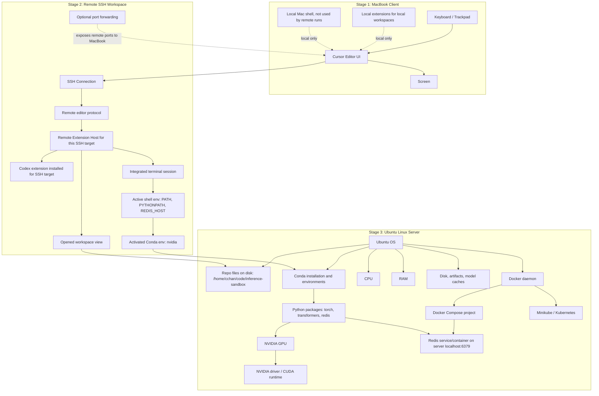

# Remote SSH
When connecting to a server/device via SSH, things to keep in mind:
**Local Machine(Client aka MacBook Pro)**
- Only keyboard, screen, and Cursor **UI ONLY** are the only components pulled locally
- Everything else runs via the remote server, aka the Ubuntu desktop for this project, which includes the following:
    - Terminal
    - `localhost:6379`
    - Hardware components like GPU, CPU, RAM, etc.
    - Conda environments
    - Docker daemons, compose, and containers
    - Kubernetes cluster, including Minikube
- A good rule of thumb is to treat the remote server as a separate machine
    - Example: Needing to install the Codex extension even when having it on both the local machine and remote server
- "Checklist" of when sshing into the remote server:
    - Status of the system and the applications running on it such as:
        - `minikube status`
        - `docker ps`
        - `kubectl get pods -w`
        - `kubectl get services -w`
        - `kubectl get deployments -w`
        - `kubectl get nodes -w`
        - Check the logs of the applications running on the remote server such as:
            - `docker compose logs app`
            - `kubectl logs deployment/inference-sandbox`
            - `kubectl logs pod-name`
            - `kubectl logs pod-name --previous`
    - Editor extensions, plugins, and settings

## Remote SSH Visual Map

# Redis
Redis is an in-memory key-value data store used for high-speed data retrieval and caching. Because data is stored in RAM, data will be lost if the server restarts and when full uses eviction policies like LRU when limits are reached.

| Use Cases | Redis Function | DL QA Application |
| --- | --- | --- |
| Caching | Store frequently accessed data in RAM for fast retrieval | Caching model outputs to avoid re-running inference for the same input |
| Queues | Send work to be processed by background workers | Queuing inference requests to be processed by background workers |
| Session states | Store temporary user data in RAM for fast retrieval | Storing user session data in RAM for fast retrieval |
| Rate Limiting | Track requests per user/API/model | Rate limiting requests to avoid abuse |
| Pub/Sub & Streams | Pass events between systems/services | Passing events between systems/services |
| Vector/Semantic Search | Store/query/retrieve vectors and semantic embeddings | Storing and querying vectors and semantic embeddings |

One thing to note is that key-value is not the same as a dictionary in Python. In Redis, keys are strings and values can be strings, numbers, lists, or hashes.

## Prefix-Cache Offload

Prefix-cache is related but not the same things KV cache. Where KV cache is for storing KV pairs for tokens already computed, Prefix-cache is for storing those KV blocks/caches for a common prefix across multiple requests so the prefill phase can be skipped or shortened.

In regards to DL QA application, it is similar to the description in the table above, but more specifically it is about taking the reusable LLM prefix/KV-cache data and storing it outside of the local inference worker like a remote Redis server. For example, in reference to this project:
- VLLM's prefix caching keeps KV cache blocks in **GPU HBM** so requests sharing a prompt prefix can skip re-prefill
- HBM is small given the 5070 Ti's 16GB being mostly taken up by model weights
- Once the HBM is full, prefix cache blocks get evicted to lower tiers like system RAM/Redis storage
- That is the purpose of Redis, to be a tier below that's network addressable where mutiple worker replicas can share a prefix cache pool where multiple workers reuse the same prompts
