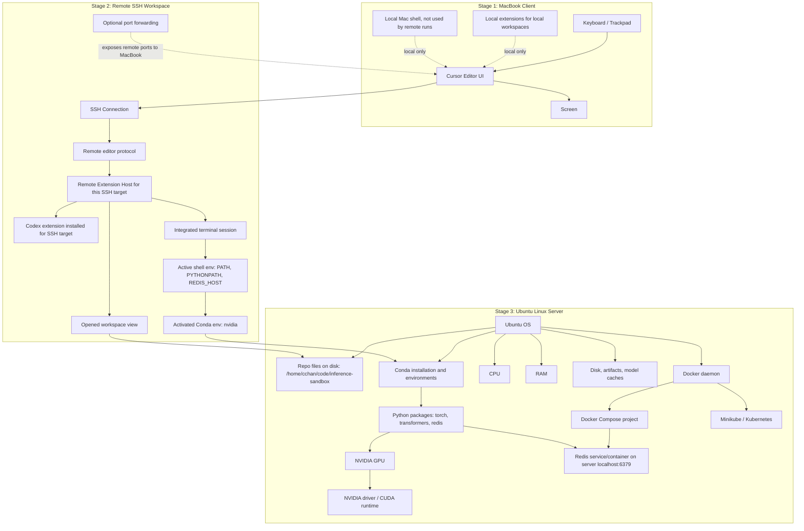
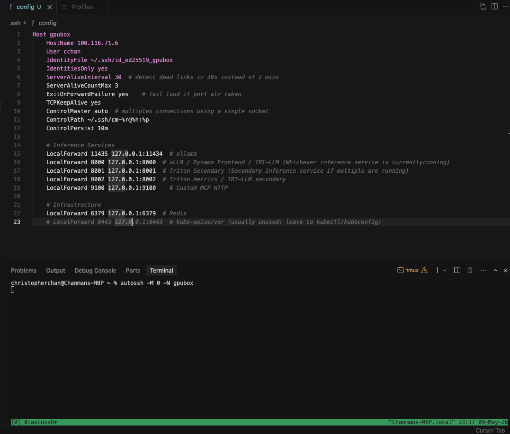

# Remote SSH

When connecting to a server/device via SSH, things to keep in mind:
**Local Machine(Client aka MacBook Pro)**
- Only keyboard, screen, and Cursor **UI ONLY** are the only components pulled locally
- Everything else runs via the remote server, aka the Ubuntu desktop for this project, which includes the following:
    - Terminal
    - `localhost:6379`
    - Hardware components like GPU, CPU, RAM, etc.
    - Conda environments
    - Docker daemons, compose, and containers
    - Kubernetes cluster, including Minikube
- A good rule of thumb is to treat the remote server as a separate machine
    - Example: Needing to install the Codex extension even when having it on both the local machine and remote server
- "Checklist" of when sshing into the remote server:
    - Status of the system and the applications running on it such as:
        - `minikube status`
        - `docker ps`
        - `kubectl get pods -w`
        - `kubectl get services -w`
        - `kubectl get deployments -w`
        - `kubectl get nodes -w`
        - Check the logs of the applications running on the remote server such as:
            - `docker compose logs app`
            - `kubectl logs deployment/inference-sandbox`
            - `kubectl logs pod-name`
            - `kubectl logs pod-name --previous`
    - Editor extensions, plugins, and settings

## Remote SSH Visual Map

# Redis

Redis is an in-memory key-value data store used for high-speed data retrieval and caching. Because data is stored in RAM, data will be lost if the server restarts and when full uses eviction policies like LRU when limits are reached.

| Use Cases | Redis Function | DL QA Application |
| --- | --- | --- |
| Caching | Store frequently accessed data in RAM for fast retrieval | Caching model outputs to avoid re-running inference for the same input |
| Queues | Send work to be processed by background workers | Queuing inference requests to be processed by background workers |
| Session states | Store temporary user data in RAM for fast retrieval | Storing user session data in RAM for fast retrieval |
| Rate Limiting | Track requests per user/API/model | Rate limiting requests to avoid abuse |
| Pub/Sub & Streams | Pass events between systems/services | Passing events between systems/services |
| Vector/Semantic Search | Store/query/retrieve vectors and semantic embeddings | Storing and querying vectors and semantic embeddings |

One thing to note is that key-value is not the same as a dictionary in Python. In Redis, keys are strings and values can be strings, numbers, lists, or hashes.

## Prefix-Cache Offload

Prefix-cache is related but not the same things KV cache. Where KV cache is for storing KV pairs for tokens already computed, Prefix-cache is for storing those KV blocks/caches for a common prefix across multiple requests so the prefill phase can be skipped or shortened.

In regards to DL QA application, it is similar to the description in the table above, but more specifically it is about taking the reusable LLM prefix/KV-cache data and storing it outside of the local inference worker like a remote Redis server. For example, in reference to this project:
- VLLM's prefix caching keeps KV cache blocks in **GPU HBM** so requests sharing a prompt prefix can skip re-prefill
- HBM is small given the 5070 Ti's 16GB being mostly taken up by model weights
- Once the HBM is full, prefix cache blocks get evicted to lower tiers like system RAM/Redis storage
- That is the purpose of Redis, to be a tier below that's network addressable where mutiple worker replicas can share a prefix cache pool where multiple workers reuse the same prompts

# tests/system/test_k8s_smoke.py Updates

The file was updated to make the kubernetes probe added reusble across tests and more explicit in error handling

| Aspect | Prev | Curr |
| --- | --- | --- |
| Result w/cluster up | Pass | Pass |
| Result w/cluster down | Fail(after 45s of retrying) | Fail(after ~3s probe) |
| Failure message detail | Connection traceback | Pod names and counts |
| Suite signal-to-noise | Red meant both infra or code | Red only means code |
| CI cost when no cluster | 45s to fail, suite red | ~3s, suite green |

# Local Hosting & Ports

Further into development, there will many services running across different ports on the local machine from the remote server such as: ollama(11434), vLLM(8000), Dynamo Frontend(8000 - collision), Triton/TRT-LLM(8000/8001/8002), Redis(6379), kube-apiserver(8443), custom MCP HTTP server(9110), etc. So understanding and organizing port mapping will be important to avoid collisions and ensure the services can be accessed from the local machine.

## IP Addresses Breakdown

- IP4 addresses are 4 bytes long, separated by dots, have a subnet mask represented by a number up to 32 bits following a slash, and a port number following a colon after the host identifier or subnet mask. Each byte is a number between 0 and 255 while the port number can range from 0 to 65535. 
- An example would be `XXX.XXX.XXX.XXX/XX:XXXX`, where the first three bytes are the network prefix, the last byte is the host identifier, the `/XX` is the subnet mask that notes how many leading bits are the network prefix, and the `:XXXX` is the port number. For example, `192.168.49.2/24:8080` is a valid IP4 address, where `/24` is the subnet mask of `255.255.255` that is &ed with the leading three bytes `192.168.49` to indicate the network prefix, the last byte `2` is the host identifier, and `8080` is the port number.
- A good analogy would be that the network prefix is the neighborhood, the host identifier is the house number, and the port number is the outlet number. This also ties into how only one device can "claim" a "house"/host, but multiple devices can "visit"/connect to the same "house"/host, with this logic being also true for the "outlet"/port but for services instead of devices.
- Additionally with ports there are two types: TCP and UDP. TCP is a connection-oriented protocol that ensures data is delivered in order and without errors, while UDP is a connectionless protocol that does not ensure data is delivered in order or without errors. So while services can conflict when having the same port number, they can coexist if they use different protocols.

So in context with this project, the table below shows the IP4 addresses of both the local machine and remote server:
| Name | Remote Server | Local Machine | Notes |
| --- | --- | --- | --- |
| localhost | 127.0.0.1/8 | <- | Loopback address where every machine has their own, used by most services via ports like:   Ollama(11434), VLLM(8000), Dynamo Frontend(8000 - collision), Triton/TRT-LLM(8000/8001/8002), Redis(6379), etc. |
| LAN/Private IP | 192.168.7.183/24 | 192.168.6.91/24 | Every device on the local network has a unique IP address but can change if the device disconnects or restarts |
| Tailscale/VPN | 100.116.71.6 | <- | Tailscale is a VPN service that allows the local machine to access the remote server where the VPN provides the private network path and the editor/IDE creates a remote SSH tunnel over that path to map the local machine to a port on the remote server's localhost. |
| Minikube | 192.168.49.0/24 | <- | The default subnet for Minikube's docker bridge/network and Kubernetes cluster.   The single Kubernetes node created is a container running `kindest/node` or `k8s.gcr.io/kube-apiserver` on `192.168.49.2`, where `apiserver` listens to port `:8443` inside that container. |
| Kubernetes | 10.96.0.0/12 | <- | The default subnet for K8s Service CIDR, used to create virtual service IPs and how they route traffic to individual pod IPs. |
| Docker | 172.17.0.0/16 | <- | Default Docker bridge subnet that creates a bridge interface called `docker0` with IP `172.17.0.1/16`, with each container running on the aforementioned bridge getting their own uniqueIP addresses from the bridge's subnet like `172.17.0.2/16` on port `:XXXX` |

# More Kubernetes Concepts

A good way to understand Kubernetes is to:
- Frame it from `Running a process on a machine` to `Describing a system and K8s creates it, keeps it running, and self-heals it` for example:
    - Traditional: `python server.py --port 8000`
    - Kubernetes:
        - Deployment: "Keep 3 copies of this container running"
        - Service: "Give them one stable internal IP address"
        - Pod/NodePort/Port-Forward: "Make them reachable from outside"
- Learn how networking and ports work in the context of Kubernetes and Docker.
- The layers of abstraction:
    - Container: The actual process running the code, like `python server.py --port 8000`
    - Pod: A group of containers that share the same network namespace, like `python server.py --port 8000` and `python server.py --port 8001`
    - Service: A stable network endpoint that routes traffic to whichever pods match its label selector, like `python server.py --port 8000` and `python server.py --port 8001`
    Node: The physical or virtual machine that runs the containers, like `192.168.49.2`
    Cluster: A group of nodes that run the containers, like `192.168.49.0/24`
    External Access: The ability to reach the containers from outside the cluster, like `192.168.49.2:8000`
- The tools and their roles:
    - Kubernetes: the actual system/API that manages pods, services, deployments, etc.
    - kubectl: CLI client for talking to the Kubernetes API.
    - Minikube: tool for creating/running a small local Kubernetes cluster.
    - Direct API/config: talking to Kubernetes without kubectl, usually via raw YAML/API calls or control-plane config.

In terms of accessing it from the "outside", you can utilize one of the three methods depending on use case:

| Access Method | Description | Use Case |
| --- | --- | --- |
| `kubectl port-forward service/service-name local-port:service-port` | Forwards localhost:N -> pod:M over the `apiserver` | Single pod/service, ad hoc testing, development |
| `kubectl proxy` | Localhost HTTP proxy to the `apiserver` | Tools that talk to the API directly like `kubectl` or `curl` |
| `minikube tunnel` | Allocates real LoadBalancer IPs on the host | Need external access to services like NodePort, LoadBalancer, etc. |

Note that for this project at its current state, these access methods are not needed as `tests/system/test_k8s_smoke.py` already uses the Kubernetes Python client to talk to the `apiserver` directly via `~/.kube/config` which already knows the IP address. Access matter more for workload testing and production deployments.

# SSH/Remote Connection Details

SSH/Remote connections are used to connect the local machine to the remote server, where the file `~/.ssh/config` is created on the local machine to configure the SSH connection details to the remote server.
Quick list of commands in regards to SSH/Remote connections:

## Local Machine Commands

- `ssh gpubox` to connect to the remote server via interactive shell
    - the -N flag is used to specify tunnel only
- Cursor's `Remote-SSH: Connect to Host` to connect via editor/IDE
- `curl http://localhost:XXXX` to check what is actually listening on the local machine's port
- `ssh -O check gpubox` to check if the connection is still alive
- `ssh -O exit gpubox` to close the connection
- Cursor's `Remote-SSH: Close Connection` to close the connection via editor/IDE
- `lsof -nP -iTCP:XXXX -sTCP:LISTEN` to check what is actually listening on the local machine's port
    - `-n` shows numerical addresses and ports
    - `-p` shows the process that is listening
    - `-iTCP:XXXX` shows the port number
    - `-sTCP:LISTEN` shows the listening sockets
    - You can also add `| grep E ':XXXX|:XXXX|...'` to filter by the exact port number

## Remote Server Commands
- `ss -lntp` to check what is actually listening on the remote server's port
    - `-l` lists listening sockets
    - `-n` shows numerical addresses and ports
    - `-t` shows TCP sockets
    - `-p` shows the process that is listening
    - You can also add `| grep E ':XXXX|:XXXX|...'` to filter by the exact port number

## SSH Connection File

**For this project the SSH connection file is configured with the following details:**

### Host Configuration
`Host gpubox`
- Defines shortcut name for the remote server 
- Prevents from having to type the full SSH command like `ssh cchan@100.116.71.6`

`    HostName 100.116.71.6`
- The IP address of the remote server or VPN like Tailscale used in this case

`    User cchan`
- Username on the remote server used to log in as

`    IdentityFile ~/.ssh/id_ed25519_gpubox`
- The private SSH key used on the local machine to authenticate with the remote server

`    IdentitiesOnly yes`
- Only uses the private key above for authentication

`    ServerAliveInterval 30  # detect dead links in 30s instead of 2 mins`
- Sends a small keepalive message every 30s instead of the default 2 mins
- Detects dead connections after sleep, Wi-Fi changes, or network drops

`    ServerAliveCountMax 3`
- If 3 keepalive checks fail, SSH considers connection dead and exits
- 30s * 3 = 90s before SSH exits

`    ExitOnForwardFailure yes    # fail loud if port alr taken`
- **IMPORTANT**: SSH fails immediately if a local port forward specified in config is already taken

`    TCPKeepAlive yes`
- Use TCP-level keep alive packets to keep the connection alive
- Lower level and secondary to `ServerAliveInterval` for detecting dead connections

`    ControlMaster auto  # multiplex connections using a single socket`
- Enables SSH to reuse existing connections to the remote server
- Allows a second `ssh gpubox` to use an already established connection with a prior `ssh gpubox` instead of making a new one
- Recommend for faster repeat connections to the remote server

`    ControlPath ~/.ssh/cm-%r@%h:%p`
- Where the SSH stores the control socket for multiplexing connections
- The placeholders mean:
    - `%r`: remote username, cchan
    - `%h`: remote hostname, 100.116.71.6
    - `%p`: SSH port, usually 22
- So translated, the control socket is stored in `~/.ssh/cm-cchan@100.116.71.6:22`

`    ControlPersist 10m`
- Keeps the master connection alive for 10 mins after the last SSH session ends
- Enables reconnects to be faster by reusing the existing connection

### Inference Services/Ports Forwarding
- The general format of port forwarding is <local-machine-port> <remote-server-address>:<remote-server-port>

`    LocalForward 11435 127.0.0.1:11434`
- Forwards localhost:11435 -> remote:11434
- Used for port forwarding the local machine's `11435` port to listen to the ollama inference service running on the remote server's `11434` port

`    LocalForward 8000 127.0.0.1:8000`
- Forwards localhost:8000 -> remote:8000
- The primary/active inference service port
- Only one of vLLM, Dynamo Frontend, or TRT-LLM can be active at a time

`    LocalForward 8001 127.0.0.1:8001`
- Forwards localhost:8001 -> remote:8001
- The secondary inference service port if primary is not available
- Used for a second inference engine, Triton gRPC, or another service

`    LocalForward 8002 127.0.0.1:8002`
- Forwards localhost:8002 -> remote:8002
- The tertiary inference service port if primary and secondary are not available
- Used for a third inference engine, Triton gRPC, or another service

`    LocalForward 9100 127.0.0.1:9100`
- Forwards localhost:9100 -> remote:9100
- Used for a custom MCP HTTP server

### Infrastructure/Ports Forwarding

`    LocalForward 6379 127.0.0.1:6379`
- Forwards localhost:6379 -> remote:6379
- Used for the Redis service

`    LocalForward 8443 127.0.0.1:8443`
- Forwards localhost:8443 -> remote:8443
- Only used if the remote server is listening on that IP address
- Usually the default IP for Minikube's API server is `192.168.49.2` and so is usually never needed

### Notes
- Some config lines can randomly be purple, this is just a visual indicator that the line is a comment
- In regards to the three port forwards for inference services, these are the possible combinations used for this project:
    - Primary (Remote engine A): vLLM / Dynamo Frontend / TRT-LLM
    - Secondary (Remote engine B): Dynamo Frontend / TRT-LLM
    - Tertiary (Remote metrics/secondary): Triton Metrics

# Autossh & Tmux

- When working with remote servers, it is useful to keep services and terminals running in the background to avoid having to restart them, especially when working with long-running or continuous processes such as but not limited to:
    - `vllm serve ...`
    - `docker run ...`
    - `python benchmark.py --long-run`
    - `nvidia-smi dmon`
    - `pytest -m gpu`
- This is where autossh and tmux come into play where:
    - tmux on gpubox keeps the services/tests alive on the remote server
    - autossh on the local machine keeps the localhost port forwards connected to the gpubox ports as long as device is not fully "shut down"

## Tmux

- Tmux is a terminal multiplexer that basically "moves" the local session terminal to a persistent session on the remote server that can be re-attached after actions that would usually disconnect the user if the session was non-persistent and local like laptop sleep after closing lid or a few minutes of inactivity
- This is one of the main purposes of tmux, and while other tools do exist like `screen` and `nohup`, tmux is the most ideal in this case due to its flexibility and features
- Tmux is ran after connecting to the remote server to "move" and make it into a persistent session from the local terminal
- So the function of tmux in this case and in general in relation back to the summary point of `Autossh & Tmux` is to fulfill keeping the long-running/continuous services or tests running the background to avoid having to restart them by keeping that terminal/session alive and re-attachable

## Autossh

- Autossh is a "monitoring" tool that "watches" the SSH connection using the config, in this case `~/.ssh/config` for `gpubox`, and reconnects automatically ONLY if the connection is briefly lost or dies like Wi-Fi changes and network drops.
- However, it will always disconnect if the device fully "shuts down" like full sleep or rebooting
- The main purpose is to prevent having to restart the ssh "instructions" via `ssh -N gpubox` after brief disconnects, where it essentially runs the ssh command instead of the user manually doing so
- So if the device does fully "shut down", the user will need to manually restart autossh via `autossh -M 0 -N gpubox` to re-establish the auto connection
    - `-M 0`: disables the multiplexing feature
    - `-N` disables the pseudo-terminal and makes it tunnel only
    - `-N` can be replaced with `-f` to run in the background
    - The image below shows the correct output when running `autossh -M 0 -N gpubox`

- Another way it is used in this case is to keep the ssh port forwarding "instructions" from the ssh alive in a second tmux session in case the primary tmux session is locally lost or disconnected, basically keeping the `LocalForward` rules active and a dedicated SSH connection running those forward instruction via the secondary tmux session