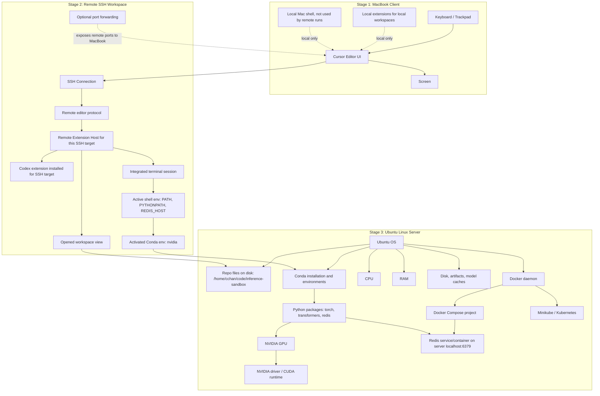

# Remote SSH
When connecting to a server/device via SSH, things to keep in mind:
**Local Machine(Client aka MacBook Pro)**
- Only keyboard, screen, and Cursor **UI ONLY** are the only components pulled locally
- Everything else runs via the remote server, aka the Ubuntu desktop for this project, which includes the following:
    - Terminal
    - `localhost:6379`
    - Hardware components like GPU, CPU, RAM, etc.
    - Conda environments
    - Docker daemons, compose, and containers
    - Kubernetes cluster, including Minikube
- A good rule of thumb is to treat the remote server as a separate machine
    - Example: Needing to install the Codex extension even when having it on both the local machine and remote server
- "Checklist" of when sshing into the remote server:
    - Status of the system and the applications running on it such as:
        - `minikube status`
        - `docker ps`
        - `kubectl get pods -w`
        - `kubectl get services -w`
        - `kubectl get deployments -w`
        - `kubectl get nodes -w`
        - Check the logs of the applications running on the remote server such as:
            - `docker compose logs app`
            - `kubectl logs deployment/inference-sandbox`
            - `kubectl logs pod-name`
            - `kubectl logs pod-name --previous`
    - Editor extensions, plugins, and settings

## Remote SSH Visual Map

# Redis
Redis is an in-memory key-value data store used for high-speed data retrieval and caching. Because data is stored in RAM, data will be lost if the server restarts and when full uses eviction policies like LRU when limits are reached.

| Use Cases | Redis Function | DL QA Application |
| --- | --- | --- |
| Caching | Store frequently accessed data in RAM for fast retrieval | Caching model outputs to avoid re-running inference for the same input |
| Queues | Send work to be processed by background workers | Queuing inference requests to be processed by background workers |
| Session states | Store temporary user data in RAM for fast retrieval | Storing user session data in RAM for fast retrieval |
| Rate Limiting | Track requests per user/API/model | Rate limiting requests to avoid abuse |
| Pub/Sub & Streams | Pass events between systems/services | Passing events between systems/services |
| Vector/Semantic Search | Store/query/retrieve vectors and semantic embeddings | Storing and querying vectors and semantic embeddings |

One thing to note is that key-value is not the same as a dictionary in Python. In Redis, keys are strings and values can be strings, numbers, lists, or hashes.

## Prefix-Cache Offload

Prefix-cache is related but not the same things KV cache. Where KV cache is for storing KV pairs for tokens already computed, Prefix-cache is for storing those KV blocks/caches for a common prefix across multiple requests so the prefill phase can be skipped or shortened.

In regards to DL QA application, it is similar to the description in the table above, but more specifically it is about taking the reusable LLM prefix/KV-cache data and storing it outside of the local inference worker like a remote Redis server. For example, in reference to this project:
- VLLM's prefix caching keeps KV cache blocks in **GPU HBM** so requests sharing a prompt prefix can skip re-prefill
- HBM is small given the 5070 Ti's 16GB being mostly taken up by model weights
- Once the HBM is full, prefix cache blocks get evicted to lower tiers like system RAM/Redis storage
- That is the purpose of Redis, to be a tier below that's network addressable where mutiple worker replicas can share a prefix cache pool where multiple workers reuse the same prompts

# tests/system/test_k8s_smoke.py Updates
The file was updated to make the kubernetes probe added reusble across tests and more explicit in error handling

| Aspect | Prev | Curr |
| --- | --- | --- |
| Result w/cluster up | Pass | Pass |
| Result w/cluster down | Fail(after 45s of retrying) | Fail(after ~3s probe) |
| Failure message detail | Connection traceback | Pod names and counts |
| Suite signal-to-noise | Red meant both infra or code | Red only means code |
| CI cost when no cluster | 45s to fail, suite red | ~3s, suite green |

# Local Hosting & Ports

Further into development, there will many services running across different ports on the local machine from the remote server such as: ollama(11434), vLLM(8000), Dynamo Frontend(8000 - collision), Triton/TRT-LLM(8000/8001/8002), Redis(6379), kube-apiserver(8443), custom MCP HTTP server(9110), etc. So understanding and organizing port mapping will be important to avoid collisions and ensure the services can be accessed from the local machine.

## IP Addresses Breakdown

IP4 addresses are 4 bytes long, separated by dots, have a subnet mask represented by a number up to 32 bits following a slash, and a port number following a colon after the host identifier or subnet mask. Each byte is a number between 0 and 255 while the port number can range from 0 to 65535. 

An example would be `XXX.XXX.XXX.XXX/XX:XXXX`, where the first three bytes are the network prefix, the last byte is the host identifier, the `/XX` is the subnet mask that notes how many leading bits are the network prefix, and the `:XXXX` is the port number. For example, `192.168.49.2/24:8080` is a valid IP4 address, where `/24` is the subnet mask of `255.255.255` that is &ed with the leading three bytes `192.168.49` to indicate the network prefix, the last byte `2` is the host identifier, and `8080` is the port number.

A good analogy would be that the network prefix is the neighborhood, the host identifier is the house number, and the port number is the outlet number. This also ties into how only one device can "claim" a "house"/host, but multiple devices can "visit"/connect to the same "house"/host, with this logic being also true for the "outlet"/port but for services instead of devices.

Additionally with ports there are two types: TCP and UDP. TCP is a connection-oriented protocol that ensures data is delivered in order and without errors, while UDP is a connectionless protocol that does not ensure data is delivered in order or without errors. So while services can conflict when having the same port number, they can coexist if they use different protocols.

So in context with this project, the table below shows the IP4 addresses of both the local machine and remote server:
| Name | Remote Server | Local Machine | Notes |
| --- | --- | --- | --- |
| localhost | 127.0.0.1/8 | <- | Loopback address where every machine has their own, used by most services via ports like:   Ollama(11434), VLLM(8000), Dynamo Frontend(8000 - collision), Triton/TRT-LLM(8000/8001/8002), Redis(6379), etc. |
| LAN/Private IP | 192.168.7.183/24 | 192.168.6.91/24 | Every device on the local network has a unique IP address but can change if the device disconnects or restarts |
| Tailscale/VPN | 100.116.71.6 | <- | Tailscale is a VPN service that allows the local machine to access the remote server where the VPN provides the private network path and the editor/IDE creates a remote SSH tunnel over that path to map the local machine to a port on the remote server's localhost. |
| Minikube | 192.168.49.0/24 | <- | The default subnet for Minikube's docker bridge/network and Kubernetes cluster.   The single Kubernetes node created is a container running `kindest/node` or `k8s.gcr.io/kube-apiserver` on `192.168.49.2`, where `apiserver` listens to port `:8443` inside that container. |
| Kubernetes | 10.96.0.0/12 | <- | The default subnet for K8s Service CIDR, used to create virtual service IPs and how they route traffic to individual pod IPs. |
| Docker | 172.17.0.0/16 | <- | Default Docker bridge subnet that creates a bridge interface called `docker0` with IP `172.17.0.1/16`, with each container running on the aforementioned bridge getting their own uniqueIP addresses from the bridge's subnet like `172.17.0.2/16` on port `:XXXX` |
