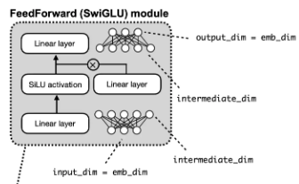

# Phase 4.1

**VRAM Calculation**
VRAM ≈ model_blob_size + KV_cache + runtime_overhead
KV_cache ≈ num_parallel * num_ctx * bytes_per_token

qwen3:0.6b - 28 layers, 8 KV heads, 128-d K/V = 112 KiB/token => 523MB + ~448MiB + overhead = ~1.1-1.6 GB
qwen3:4b - 36 layers, 8 KV heads, 128-d K/V = 144 KiB/token => 2.6GB + ~576MiB + overhead = ~3.3-4.0 GB
qwen3:8b - 36 layers, 8 KV heads, 128-d K/V = 144 KiB/token => 5.2GB + ~576MiB + overhead = ~5.8-6.6 GB

These expected VRAM numbers match the result listed for each model in `artifacts/ollama/ollama_results.jsonl`. Throughput also decreases as model size increases when looking at `tokens_per_sec`, which matches the expected trend because larger models require more compute and memory bandwidth during generation.

**Prefill vs decode**  
In LLM serving, the **prefill** pass processes the whole prompt in one (or a few) forward steps and is usually compute-bound; that phase dominates **TTFT** (time to first output token). The **decode** loop then generates one token at a time and is usually memory-bandwidth–bound; that is what **TPOT** and sustained **tokens/sec** are about. Ollama hides a lot of detail, but the point for benchmarking is: a long prompt pushes prefill cost (TTFT), while long generations stress decode (throughput). I did not try to measure TPOT separately in Ollama, but the vocabulary is the same as in the guide.

TTFT also trends higher on the larger models compared with the 0.6b baseline. In my runs, the average TTFT was about 4.99s for qwen3:0.6b, 11.87s for qwen3:4b, and 7.15s for qwen3:8b. That is not perfectly monotonic across every prompt, but the larger models still showed higher startup latency overall than the smallest model, while the throughput trend was cleaner and consistently lower as model size increased.

**When numbers do not look “textbook”**
If TTFT is weirdly low for a big model, if throughput does not match model size, or if VRAM looks like the wrong model: first check `ollama ps` where a previous run may have left a model loaded so the next request skips cold load. Also compare prompt length and `prompt_eval_count` (longer prefill = higher TTFT). Thermals, background GPU use, and non-`content` “thinking” chunks can all skew what feels like a single number.

**SDET angle:** this phase is about *fair* local performance measurement: same definitions, clean baselines, and traceable field mappings so results can be triaged and compared over time.

Streaming a prompt through Ollama does not always happen in rigid "thinking, then content, then done" phases, but those are the main fields I observed while debugging. A streamed chat response arrives as a sequence of chunks. Some chunks may contain `thinking` text for models that expose reasoning, later chunks may contain `content` text for the visible answer, and the final chunk marks `done=True` and includes inference metadata.

The key benchmarking concept is that TTFT should be measured from the moment the request starts until the first non-empty `message.content` arrives. I should not use the first `thinking` chunk for TTFT if I want "time to first visible answer token." (In user-facing talk people say “word” but the API really moves in tokens; chunks are not tokens.)

Another important distinction is that a chunk is not the same thing as a token. A chunk is just one streamed delivery unit. One chunk may contain part of a token, one whole token, several tokens' decoded text, thinking text, content text, or final metadata. Because chunk boundaries do not equal token boundaries, chunk count is not a reliable way to measure throughput.

Examples of the chunk types I saw while debugging:
```
model='qwen3:0.6b' created_at='2026-04-16T23:48:59.480108555Z' done=False done_reason=None total_duration=None load_duration=None prompt_eval_count=None prompt_eval_duration=None eval_count=None eval_duration=None message=Message(role='assistant', content='', thinking='Okay', images=None, tool_name=None, tool_calls=None) logprobs=None
```
```
model='qwen3:0.6b' created_at='2026-04-16T23:48:59.855393042Z' done=False done_reason=None total_duration=None load_duration=None prompt_eval_count=None prompt_eval_duration=None eval_count=None eval_duration=None message=Message(role='assistant', content=' GPU', thinking=None, images=None, tool_name=None, tool_calls=None) logprobs=None
```
```
model='qwen3:0.6b' created_at='2026-04-16T23:49:00.033040225Z' done=True done_reason='stop' total_duration=618850858 load_duration=50740080 prompt_eval_count=20 prompt_eval_duration=10459675 eval_count=286 eval_duration=509266708 message=Message(role='assistant', content='', thinking=None, images=None, tool_name=None, tool_calls=None) logprobs=None
```

The final metadata chunk can contain these useful Ollama fields:
- `model`: the model used for the request.
- `created_at`: when the chunk was created.
- `done`: whether the response stream has finished.
- `done_reason`: why generation stopped.
- `total_duration`: total request time in nanoseconds.
- `load_duration`: model load time in nanoseconds.
- `prompt_eval_count`: number of input prompt tokens.
- `prompt_eval_duration`: prompt processing time in nanoseconds.
- `eval_count`: number of output tokens generated during decoding.
- `eval_duration`: output generation time in nanoseconds.
- `message.content`: visible answer text.
- `message.thinking`: reasoning text for models that expose it.

In `src/inference_sandbox/ollama_bench.py`, I currently use these fields and definitions:
- `ttft_s`: wall-clock time from request start until the first visible `content` arrives.
- `total_time_s`: wall-clock time from request start until the stream ends.
- `generated_tokens`: taken from Ollama's `eval_count`, representing output tokens generated by the model. It is not the number of chunks and not specifically "thinking tokens."
- `eval_duration_s`: `eval_duration` converted from nanoseconds to seconds, representing time spent generating output tokens.
- `tokens_per_sec`: `generated_tokens / eval_duration_s`, which is a better throughput signal than guessing from word splits.
- `load_duration_s`: `load_duration` converted to seconds, representing time spent loading the model.
- `prompt_tokens`: taken from `prompt_eval_count`, representing how many prompt/input tokens Ollama processed.
- `prompt_eval_duration_s`: `prompt_eval_duration` converted to seconds, representing prompt processing time.
- `vram_before_mb`: GPU memory before the request.
- `vram_after_mb`: GPU memory after the request.
- `vram_delta_mb`: change in GPU memory usage across the request.

The big takeaway is that chunks are useful for detecting TTFT and understanding the stream structure, while the final Ollama metadata chunk is the better source for throughput-related metrics such as generated token count and generation duration.

When measuring models in Ollama, if a model is still listed in `ollama ps`, run `ollama stop <model>` before a clean run. The SDK reuses a loaded model, which breaks cold-load and VRAM baselines.

# Phase 4.2

The dtype comparison matched expectations: FP32 used about 2x the VRAM of FP16 and BF16 because each parameter uses 4 bytes instead of 2. FP16 and BF16 had similar VRAM usage, TTFT, and throughput on the RTX 5070 Ti, while FP32 was slower overall. I implemented dtype comparison, Redis-backed result storage, and TTFT with `TextIteratorStreamer` in `src/inference_sandbox/hf_bench.py`.

**Controlled comparison**  
Each dtype run used the same HuggingFace model id (`TinyLlama/TinyLlama-1.1B-Chat-v1.0`), the same tokenizer, the same chat template path, the same prompt list, and the same `max_new_tokens` / `do_sample=False` generation settings. The only intentional variable was `dtype` passed to `from_pretrained` (and moving weights to the same GPU). That way a VRAM or speed delta is actually about precision, not a sneaky config change.

**Why FP16 and BF16 look similar**  
Both use 2 bytes per weight in memory, so footprint tracks. On Ampere-and-newer consumer GPUs, BF16 and FP16 often land in the same ballpark for inference time because the hardware is built for 16-bit math. BF16 has the same exponent range as FP32 (roughly) with fewer mantissa bits; FP16 is tighter in range. For *this* inference pass the difference was small, which is what I expected, but the point of Phase 4.3 is to *test* that claim instead of assuming it.

**If something looked wrong, I would check**  
- VRAM not ~2× for FP32 vs 16-bit: wrong dtype on weights, or model not fully on GPU.  
- Absurd TTFT: streaming path, or prompt length, or a cold vs warm load.  
- Nonsense text or NaNs: bad cast, or generation still in “train” mode (`model.eval()`).  
- Mismatched token counts across dtypes: different tokenizer or template path (should not happen if config is shared).

**Redis**  
I store structured benchmark rows in Redis so I can diff runs over time. That is the start of a regression story: a future change should not silently shift TTFT or tokens/sec without a commit that explains why.

**SDET angle:** 4.2 is a *reproducible* performance baseline for the same workload, the habit needed before calling a later optimization “faster” with evidence.

**TTFT and TPOT**  
- **TTFT**: time from request (or from “start stream”) until the first user-visible output token. Dominated by prefill for a long prompt.  
- **TPOT**: average time between output tokens in the decode loop; bandwidth-heavy. I measured TTFT in HF; I did not split out TPOT as a separate number in 4.2, but the distinction matters when I read vLLM/TRT-LLM benches later.

# Phase 4.3: Quantization quality gate (dtype accuracy)

This sub-phase is not more Ollama/HF speed testing; it is a **quality assertion**: lower-precision inference should not drift far from FP32 *on the same text* when the only change is dtype. That is the SDET pattern: turn “should be fine” into a failing test if something regresses in casting, kernels, or config.

**NLL (negative log-likelihood)**  
For each next-token position the model assigns a probability `p` to the *true* next token. **NLL = -log(p).** Low NLL means the model put high mass on the right token (not “surprised”). High NLL means it assigned the correct token low probability. Across the corpus we care about the **average** NLL per predicted token; that is what HuggingFace’s causal LM `outputs.loss` is (mean NLL over positions in that forward pass).

**What perplexity is**  
The model outputs a distribution over the vocabulary for each next token. I aggregate across many lines by **summing** `loss * n_tokens` per line and dividing by **total predicted tokens** so long lines count more than short ones (not a naive average of per-sentence means). **Perplexity is exp of that corpus-average NLL.** A PPL of 15 means the model behaves roughly like it is “choosing among ~15 equally likely” next tokens on average; lower is better.

**PPL vs “accuracy”**  
Perplexity is a **generative** signal: how well the next-token distribution matches real text. **Task accuracy** (MMLU, exact match on QA, pass@k on code, etc.) depends on prompts, decoding, and the benchmark itself. **Correlation:** if the model’s distribution is badly wrong, PPL often rises and downstream tasks often suffer. **Non-equivalence:** similar PPL does not guarantee similar task scores (instruction tuning, format, safety, reasoning). So this dtype test is **not** “MMLU dropped 2%”; it is **“did the next-token likelihood on fixed WikiText stay near the FP32 reference when we only changed precision?”** That is still a form of **quality / regression** check, aimed at **distribution drift** and subtle kernel or cast bugs, not a full product accuracy report.

**What the test gates**  
If the absolute gap between FP16 (or BF16) PPL and FP32 PPL stays under tolerance, the cast is behaving. A large jump means something in the stack is wrong (bad weights path, wrong kernel, tokenizer mismatch, etc.), the kind of bug a release pipeline should catch.

**What I built**  
- `src/inference_sandbox/perplexity.py`: `corpus_perplexity()` with token-weighted NLL.  
- `tests/integration/test_quantisation.py`: loads TinyLlama in FP32 / FP16 / BF16, uses a WikiText-2 *test* subset (first 200 non-empty, non-header lines), asserts drift vs FP32 reference under `PPL_TOLERANCE = 0.5`, marked `gpu` and `slow` with skip on CPU-only runs.

**Limitations**  
Perplexity measures next-token fit on a Wikipedia-like slice. It does not replace MMLU, safety evals, or end-user product tests; it is a cheap, strong **numerical** gate for this phase. FP32 stays the **comparison** anchor not because FP16 is “bad” for serving (often the opposite), but because a wide, stable reference makes dtype drift easy to see and keeps the test from comparing two noisy low-precision paths to each other.

**Why FP32 as reference, not “just use FP16 as baseline”**  
For this gate I compare FP16/BF16 to **FP32** because training and many papers assume FP32 math for the checkpoint, and I want the clearest “golden” for **did anything change in the stack?** In production, FP16/BF16 inference is common once it passes gates like this; the baseline choice here is about **test design**, not claiming FP32 is the only way to ship.

- Time To First Token (TTFT) in serving is still the “first answer latency” story; in 4.3 I did not re-benchmark TTFT.  
- BF16: the test asserts it against the same FP32 reference; my scratch sanity on 20 lines showed FP32 and FP16 at ~14.1 PPL with drift below a cent, and the full test passes for BF16 as well.

- 0.5 tolerance is an engineering decision, based on these three points: 
    1) **It is not just `==fp32`** because floating-point addition isn't associative. Different kernels reduce sums in different orders, so even when running the same FP32 code on different hardware you can get slightly different losses. For this reason, having zero tolerance results in a flaky test.  
    2) **It is not 5.0 or 10.0** because well-behaved FP16 casting on TinyLlama should be within ~0.1 of FP32 PPL in practice; a tolerance value like 5.0 would let real quantisation bugs slip through. It is the mirror of the first point: a band that is *too* loose is also a bad test because it stops catching regressions.  
    3) Tolerance value can change depending on what you're working on, but 0.5 empirically is the number that's small enough to catch bugs, but also large enough to filter out noise for most FP/BF16 inference paths on modern hardware: 
        - It can be lowered for release-gate testing where you're comparing two builds of the same model since non-dtype noise cancels out.  
        - It can also be raised for areas like cross-hardware comparisons, different attention implementations, or INT4/INT8 quantisation where unlike FP32→FP/BF16, accuracy loss is part of the design.

Sanity-checked `corpus_perplexity()` on 20 WikiText-2 sentences before writing the full test. Both FP32 and FP16 produced PPL ≈ 14.10 on 3199 tokens, which is consistent with a well-behaved FP16 cast (drift < 0.01).

```
python scratch_ppl.py  # FP16, 20 sentences
PPL (FP16, 20 sentences): 14.1017  | Tokens: 3199

python scratch_ppl.py  # FP32, 20 sentences  
PPL (FP32, 20 sentences): 14.1001  | Tokens: 3199

Drift: 0.0016, well within the 0.5 tolerance threshold.
```

**SDET angle:** 4.3 is the complement to 4.1/4.2’s "speed" work, a gate that says “this precision path is still the same model,” not just “it runs fast.” Task evals and golden generations still belong elsewhere; PPL here catches a different failure class (math / weights / kernels) cheaply. Pytest flags --slow and --gpu behave the same as other flags but just different syntax like `pytest tests/integration/test_quantisation.py -v --slow --gpu` vs `pytest -m "integration"`. However they can be implied to mean something like `slow` indicating expensive tests like perplexity evaluation and `gpu` requiring CUDA. Flags only work if registered as custom pytest options via `pytest_addoption` and collection filtering via `pytest_collection_modifyitems` in `tests/conftest.py`.

# Phase 4.4:

To find model configs, there are three ways:
    1. **Browser**: Pages like HF contain model configs through `config.json` in the tab **Files and versions**
    2. **Using Python**: Running the python script after activating the environment:
        `from transformers import AutoConfig`
        `cfg = AutoConfig.from_pretrained("TinyLlama/TinyLlama-1.1B-Chat-v1.0")`
        `print(cfg)`
    Will return the parameters of the model
    3. **On disk after download**: For HF specifically, `config.json` caches it in the folder `~/.cache/huggingface/hub/`. However, the previous two methods are more ideal.

Different `model_type`/architecture changes the layer formula, so the attention and MLP decomposition below is for Llama-class checkpoints. For unfamiliar architectures, `AutoModel.from_pretrained` + `.num_parameters()` or HF model cards validates formulas.

**Query heads make a query vector q from the current token. They let the model specialize in different ways of asking questions about the context. They are also represented in model configs as the variable `num_attention_heads`.

**Key heads make key vectors k for all past tokens. They help the model decide whether a past token matches the current query, typically using a score like q⋅k (usually scaled by 1/sqrt(d)).

**Value heads make value vectors v for all past tokens. They provide the content that gets retrieved once the model decides where to attend.

**A good way to summarize this is: query heads are readers that choose attention patterns, while KV heads are memory slots that represent the cached context those queries read from.

**In MHA, each query head has its own corresponding key and value head. In GQA, many query heads share fewer key/value heads. The tradeoff is slightly less flexibility, but much lower KV-cache memory use and memory bandwidth during inference, usually with only a small quality loss.

| Notation | `config.json` | TinyLlama-1.1B-Chat-v1.0 |
|---|---|---|
| **L** | `num_hidden_layers` | 22 |
| **H** | `hidden_size` | 2048 |
| **V** | `vocab_size` | 32000 |
| **A** | `num_attention_heads` | 32 |
| **K** | `num_key_value_heads` | 4 |
| **I** | `intermediate_size` | 5632 |
| **T** | `max_position_embeddings` | <=2048 |

**`use_cache` in config means KV cache matters for `generate`
**`max_position_embeddings` is the upper bound for the range `T` can grow

****K**(`num_key_value_heads`) has 3 distinct variations:
- `K==A`: Full MHA (no grouping for KV)
- `K==1`: MQA(multi-query) with 1 K and 1 V shared by all Q heads
- `1<K<A`: Grouped-query attention (GQA) - middle ground between MHA and MQA

****I** uses **SwiGLU blocks**, a specific pattern for the feed-forward network (FFN) sublayer inside each transformer block. 
- Model families like LLaMA or Mistral are formulas for the full decoder like attention style, norm placement, how many layers, etc, and choose an FFN style. 
- In Llama class models the FFN is SwiGLU, which are three linear maps with shapes expressed in **H** & **I**. Two projects map **H**->**I**(gate & up) while one maps **I**->**H**(down), so **I** sets how wide that inner bottleneck is compared to **H**>
- In the image below, the label `intermediate_dim` marks the inner width of the SwiGLU block, the same quantity as the variable `intermediate_size`. It is not a layer count, but the wide ("fat") dimension of the FFN.



| Formula | Description |TinyLlama-1.1B-Chat-v1.0 |
|---|---|---|
| **D = H / A** | Head Dimension | `2048/32=64` |
| **P_embed = V * H** | Token Embeddings | `32000*2048=65536000` |
| **P_q = H * (A * D)** | Query Projection | `2048*(32*64)=4194304` |
| **P_o = H * (A * D)** | Output Projection | `2048*(32*64)=4194304` |
| **P_k = H * (K * D)** | Key Projection | `2048*(4*64)=524288` |
| **P_v = H * (K * D)** | Value Projection | `2048*(4*64)=524288` |
| **P_attn_total = P_q + P_o + P_k + P_v** | Attention module param count | `9437184` |
| **P_mlp_total = H * I + H * I + I * H** | The three matrices shape for Llama class models | `3*2048*5632=34603008` |
| **P_norm_layer ~= 2 * H** | Per-layer norms(RMSNorm) | `2*2048=4096` |
| **P_layer = P_attn_total + P_mlp_total + P_norm_layer** | Per layer | `9437184+34603008+4096=44044288` |
| **P_lm_head = V * H** | Output / LM Head | `32000*2048=65536000` |
| **P_total ≈ P_embed + P_layer + H + P_lm_head** | Total approx parameters | `65536000+22*44044288+2048+65536000=1.10*10^9` |
| **VRAM_weights ≈ P_total * B** | Params -> static weight VRAM | `1.10*10^9*2=2.2*10^9` |
| **Bytes_per_kv_token ≈ L * (2) * H_kv * D * B** | How much KV-cache memor one token uses | `22*2*4*64*2=22528` |
| **VRAM_KV ≈ N * T * Bytes_per_kv_token** |  | ` |
| **KV_cache ≈ num_parallel * num_ctx * bytes_per_token** |  | ` |
| **VRAM ≈ VRAM_weights + VRAM_KV + VRAM_activation_peak + allocator_overhead** |  | ` |

**Final norm if present appears before LM head, which adds another **H** param

**For **Output / LM Head**:
- If `tie_word_embeddings=true`, `P_lm_head=0` as embeddings and output share weights
- If `tie_word_embeddings=false`, `P_lm_head=V*H`

**The variable B is bytes per element, taken from inference dtype (2 for FP/BF16, 4 for FP32, etc)

**To check `P_total`, use `sum(p.numel() for p in model.parameters())`. If that disagrees with the theoretical layer count, suspect embedding/LM-head tie, GQA mismatch, or a nonstandard MLP are usually the causes for discrepancy if the theoretical calculation does not line up.

**The `H_kv` variable in `Bytes_per_kv_token` formula changes depending on which KV group was used:
- **Full MHA** => `H_kv=A`
- **MQA** => `H_kv=1`
- **GQA** => `H_kv=num_key_value_heads` from config